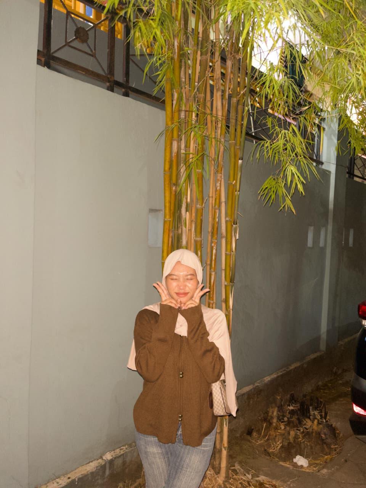

# Analisis Biografi
1. HTML
```html
    <!DOCTYPE html>
    <html lang="id">
    <head>
        <meta charset="UTF-8">
        <meta name="viewport" content="width=device-width, initial-scale=1.0">
        <title>Portofolio Hidup Kita</title>
    <style>
    body {
      font-family: "Comic Sans MS", cursive, sans-serif;
      margin: 0;
      padding: 0;
      background: #fff9db;
      color: #333;
    }
```

Codingan dimulai dengan <!DOCTYPE html>, yang memberi tahu browser bahwa dokumen ini adalah HTML5.
Lalu <html lang="id"> menandakan bahasa yang digunakan adalah Bahasa Indonesia. Di dalam <head>,
ada pengaturan dasar seperti charset UTF-8 agar teks terbaca dengan benar, viewport supaya tampilan
responsif di HP, judul halaman <title>Portofolio Hidup Kita</title>, serta kode CSS untuk mengatur desain tampilan website.

2. HTML
```html
    header {
      background: #6bc1ff;
      color: white;
      text-align: center;
      padding: 30px;
      border-bottom: 6px solid white;
    }

    header h1 {
      margin: 0;
      font-size: 2.5em;
    }

    header p {
      margin-top: 5px;
      font-size: 1.2em;
    }
```

Di dalam <body>, ada bagian header yang berisi judul "🌟 Portofolio Hidup Kita 🌟" dan teks kecil di bawahnya "Cerita hidup sederhana dan penuh warna🤭". CSS pada header memberi latar belakang biru, tulisan putih, teks di tengah, serta padding agar terlihat rapi dan menonjol.

3. HTML
```html
    nav {
      background: #0091ff;
      text-align: center;
      padding: 12px;
    }

    nav a {
      margin: 0 15px;
      text-decoration: none;
      color: #333;
      font-weight: bold;
    }

    nav a:hover {
      color: #6bc1ff;
    }
```

Setelah itu ada <nav>, yaitu menu navigasi dengan beberapa link: Tentang, Data Pribadi, Hobi, dan Kontak. Menu ini diberi warna biru tua dengan teks tebal berwarna gelap, dan jika diarahkan kursor (hover), warnanya berubah menjadi biru muda. Menu ini memudahkan pengunjung berpindah ke bagian tertentu dalam halaman.

4. HTML
```html
     .container {
      width: 80%;
      margin: 20px auto;
    }
```

Pada bagian .container, kode ini membuat isi halaman memiliki lebar 80% dari layar dan diletakkan tepat di tengah dengan memberi jarak 20 piksel di bagian atas dan bawah.

5. HTML
```html
    section {
      background: #6bc1ff;
      padding: 20px;
      margin-bottom: 25px;
      border-radius: 20px;
      box-shadow: 4px 4px 0px #333;
    }
```

Bagian section diatur agar setiap bagiannya memiliki latar belakang biru muda, diberi ruang dalam 20 piksel supaya isi tidak menempel pada tepi, serta jarak antarbagian 25 piksel. Sudut setiap section dibuat melengkung, lalu ditambahkan bayangan abu-abu agar terlihat seperti kotak timbul.

6. HTML
```html
    h2 {
      color: #ff6b6b;
      margin-bottom: 10px;
    }
```

Judul setiap bagian (h2) diberi warna merah muda cerah agar lebih menonjol, dan diberi jarak 10 piksel di bawahnya supaya tidak terlalu rapat dengan isi.

7. HTML
```html
    #tentang img {
      width: 150px;
      border-radius: 50%;
      display: block;
      margin: 10px auto;
      border: 5px solid #ff6b6b;
    }
```

Khusus pada gambar di bagian “tentang” (#tentang img), gambar ditampilkan dengan lebar 150 piksel, dibentuk menjadi lingkaran menggunakan border-radius 50%, lalu diletakkan di tengah dengan margin otomatis. Gambar ini juga diberi bingkai berwarna merah muda setebal 5 piksel sehingga terlihat lebih menarik.

8. HTML
```html
    ul {
      list-style: "✨ ";
      padding-left: 20px;
    }
```

Terakhir, daftar (ul) diatur agar simbol bullet bawaannya diganti dengan ikon ✨, lalu diberi jarak 20 piksel dari sisi kiri supaya tampil lebih rapi.

9. HTML
```html
   form {
      display: flex;
      flex-direction: column;
      gap: 12px;
    }
```

Pada bagian form, kode ini mengatur agar form ditampilkan menggunakan sistem flexbox dengan arah kolom (flex-direction: column). Artinya, semua elemen input, textarea, dan tombol di dalam form akan tersusun ke bawah. Selain itu, ada jarak 12 piksel antar setiap elemen agar tidak saling menempel.

10. HTML
```html
    input, textarea {
      padding: 10px;
      border: 3px solid #ff6b6b;
      border-radius: 10px;
      font-size: 1em;
    }
```

Untuk bagian input dan textarea, keduanya diberi ruang dalam (padding) sebesar 10 piksel supaya teks tidak menempel ke tepi kotak. Batas (border) dibuat setebal 3 piksel dengan warna merah muda, sudut kotak dibulatkan 10 piksel agar lebih halus, serta ukuran huruf diatur menjadi 1em agar nyaman dibaca.

11. HTML
```html
    button {
      background: #ff6b6b;
      color: white;
      padding: 10px;
      border: none;
      border-radius: 15px;
      font-size: 1em;
      cursor: pointer;
      box-shadow: 3px 3px 0px #333;
    }
```

Bagian button diatur supaya tombol memiliki latar belakang merah muda, teks berwarna putih, dan diberi ruang dalam 10 piksel sehingga tombol terlihat lebih besar. Tombol tidak memiliki garis tepi (border: none), tetapi sudutnya dibulatkan 15 piksel. Ukuran huruf di dalam tombol juga 1em. Agar tombol tampak interaktif, cursor berubah menjadi tanda tangan (pointer) ketika diarahkan. Selain itu, tombol diberi bayangan gelap tipis agar terlihat timbul.

12. HTML 
```html
    button:hover {
      background: #ff922b;
    }
```

Pada bagian button:hover, kode ini membuat tombol berubah warna menjadi oranye (#ff922b) ketika disentuh kursor. Efek ini memberi kesan bahwa tombol aktif dan siap ditekan.

13. HTML
```html
    footer {
      background: #ff6b6b;
      color: white;
      text-align: center;
      padding: 15px;
      margin-top: 30px;
      border-top: 6px solid #fff9db;
    }
  </style>
</head>
```

Pertama, pada bagian CSS footer, kode tersebut mengatur tampilan area paling bawah halaman (footer). Latar belakangnya berwarna merah muda (#ff6b6b), teksnya berwarna putih, dan semua isi footer ditempatkan di tengah dengan text-align: center. Bagian dalam footer diberi jarak (padding) 15 piksel agar teks tidak terlalu menempel. Lalu, ada jarak ke atas sebesar 30 piksel (margin-top: 30px) supaya footer tidak menempel dengan konten sebelumnya. Tambahan border-top: 6px solid #fff9db memberi garis tebal di bagian atas footer dengan warna krem (#fff9db) sehingga terlihat seperti pemisah.

14. HTML
```html
    <header>
    <h1>🌟 Portofolio Hidup Guehhh 🌟</h1>
    <p>Cerita hidup sederhana dan penuh warna🤭</p>
  </header>
```

Setelah itu, masuk ke bagian body halaman, yaitu <header>. Bagian ini menampilkan judul utama halaman portofolio. Judul ditulis dengan <h1> yang berisi teks “🌟 Portofolio Hidup Guehhh 🌟”, lalu ada paragraf <p> berisi deskripsi singkat “Cerita hidup sederhana dan penuh warna🤭”. Header ini adalah bagian pengenalan utama dari halaman.

15. HTML
```html
    <nav>
    <a href="#tentang">Tentang</a>
    <a href="#pengalaman">Data Pribadi</a>
    <a href="#hobi">Hobi</a>
    <a href="#kontak">Kontak</a>
  </nav>
```

Kemudian ada bagian navigasi (nav). Di sini dibuat menu navigasi dengan beberapa tautan <a>. Tautan tersebut menuju ke bagian tertentu dalam halaman:
#tentang menuju bagian Tentang,
#pengalaman menuju Data Pribadi,
#hobi menuju bagian Hobi,
#kontak menuju bagian Kontak.
Dengan adanya navigasi ini, pengunjung bisa mengklik menu untuk langsung menuju ke bagian yang diinginkan tanpa harus scroll panjang.

16. HTML 
```html
      <div class="container">
```

Pertama, ada sebuah container <div class="container"> yang berfungsi sebagai wadah utama untuk menampung semua bagian isi halaman. Di dalam container ini terdapat beberapa section yang mewakili bagian-bagian tertentu dari portofolio.

17. HTML
```html
    <section id="tentang">
      <h2>🙋 Tentang</h2>
      
      <p>Hai perkenalkan nama aku Ika Maryana Mudrikah aku mahasiswa Universitas Negeri Makassar,
        aku lahir di Kalimanta Timur umurku 20 tahun tapi nanti bulan 10 tanggal 6 wkwk, hobiku tuh
        main bultang🏸sama teman-teman terus cita -cita ku tuh mau jadi programmer👩🏻‍💻tapi ngga taubisa apa ngga tapi semoga bisa ya allah🤲🏻.
        Hidup ini ibarat mie instan 🍜 — kadang pedas, kadang hambar, tapi selalu bisa bikin kenyang.  
      Saya percaya hidup harus dijalani dengan <b>senyum 😊</b> dan secangkir kopi ☕.</p>
    </section>
```

Bagian pertama adalah section dengan id "tentang". Di sini terdapat judul <h2> dengan teks “🙋 Tentang” untuk menandai bahwa ini adalah bagian perkenalan diri. Selanjutnya ditampilkan sebuah foto profil dengan elemen . Setelah itu ada paragraf <p> panjang yang berisi perkenalan: menyebutkan nama, asal kampus, tempat lahir, umur, hobi, cita-cita, dan filosofi hidup. Paragraf ini juga memanfaatkan elemen <b> untuk menebalkan kata “senyum 😊” agar lebih menonjol. Jadi, bagian ini berfungsi untuk memberi gambaran singkat tentang diri pemilik portofolio.

18.  HTML
```html
    <section id="pengalaman">
      <h2>📖 Data Pribadi</h2>
      <table>
        <tr>
          <td>Nama</td>
          <td>:Ika Maryana Mudrikah</td>
        </tr>
        <tr>
          <td>Tempat/Tanggal Lahir</td>
          <td>:Kembang Janggut, 06 Desember 2005</td>
        </tr>
        <tr>
          <td>Jenis kelamin</td>
          <td>:Perempuan</td>
        </tr>
        <tr>
          <td>Agama</td>
          <td>:Islam</td>
        </tr>
        <tr>
          <td>Status</td>
          <td>:Mahasiswa</td>
        </tr>
        <tr>
          <td>Gmail</td>
          <td>:iika47889gmail.com</td>
        </tr>
      </table>
    </section>
```

Kemudian masuk ke section kedua dengan id "pengalaman". Walaupun id-nya “pengalaman”, bagian ini sebenarnya berisi Data Pribadi. Judulnya ditulis dengan <h2> berisi teks “📖 Data Pribadi”. Lalu ada sebuah tabel <table> yang digunakan untuk menampilkan informasi pribadi dalam bentuk baris dan kolom.
Baris pertama menampilkan Nama beserta isinya.
Baris kedua menampilkan Tempat/Tanggal Lahir.
Baris ketiga berisi Jenis Kelamin.
Baris keempat berisi Agama.
Baris kelima berisi Status.
Baris keenam berisi Gmail sebagai kontak email.
Dengan penggunaan tabel ini, data pribadi terlihat lebih rapi, mudah dibaca, dan terstruktur.

19. HTML
```html
        <section id="hobi">
      <h2>🎉 Hobi & Kesukaan</h2>
      <ul>
        <li>Makan cemilan sambil nonton drama🍿</li>
        <li>Membaca buku📖</li>
        <li>Tiudr sepanjang hari🛌🏼</li>
        <li>Minum kopi☕</li>
      </ul>
    </section>
```

Pertama, ada section dengan id "hobi". Bagian ini ditandai dengan judul <h2> bertuliskan “🎉 Hobi & Kesukaan”. Di dalamnya terdapat sebuah daftar tidak berurutan <ul> dengan beberapa item <li>. Masing-masing item menampilkan hobi pemilik portofolio, seperti makan cemilan sambil nonton drama, membaca buku, tidur sepanjang hari, dan minum kopi. Daftar ini mempermudah pengunjung melihat apa saja aktivitas kesukaan secara singkat dan rapi.

20. HTML
```html
    <section id="kontak">
      <h2>📩 Kontak Saya</h2>
      <form>
        <input type="no hp" placeholder="NoHP:081349455410" required>
        <input type="ig" placeholder="IG:ikakaaaa" required>
        <textarea rows="4" placeholder="Asmarlana mu adalah amerta yang terpenjara dalam lengkara,
        menjadi renjana yang hanya bisa tertulis dalam aksara kalbuku..."></textarea>
        <button type="submit">Kirim Yuk 🚀</button>
      </form>
    </section>
  </div>
```

Selanjutnya, ada section dengan id "kontak". Judulnya <h2> adalah “📩 Kontak Saya”. Di bagian ini terdapat sebuah form <form> untuk mengisi data.
Input pertama adalah kolom nomor HP dengan placeholder “NoHP:081349455410”.
Input kedua adalah kolom akun Instagram dengan placeholder “IG:ikakaaaa”.
Lalu ada <textarea> yang memberikan ruang untuk menuliskan pesan. Placeholder pada textarea berisi kalimat puitis untuk contoh isian.
Di akhir form ada tombol <button type="submit">Kirim Yuk 🚀</button> yang bisa ditekan untuk mengirimkan data.

21. HTML
```html
    footer>
    <p>© 2025 Portofolio Hidup Guehh | Dibuat dengan ❤️, HTML & CSS</p>
  </footer>

</body>
</html>
```

Setelah itu, ada elemen footer di bagian paling bawah halaman. Footer ini ditampilkan dengan teks “© 2025 Portofolio Hidup Guehh | Dibuat dengan ❤️, HTML & CSS”. Bagian footer berfungsi sebagai penutup halaman dan memberi keterangan hak cipta sekaligus pesan personal dari pembuat portofolio.