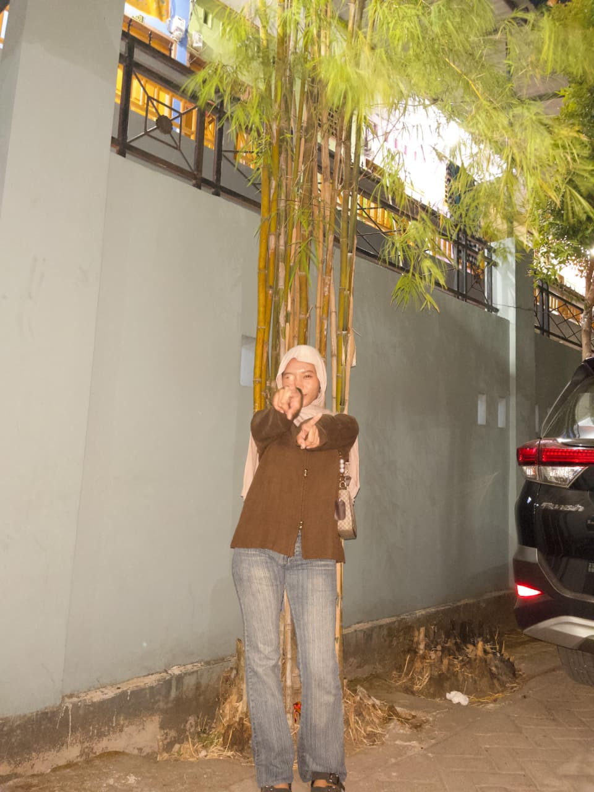
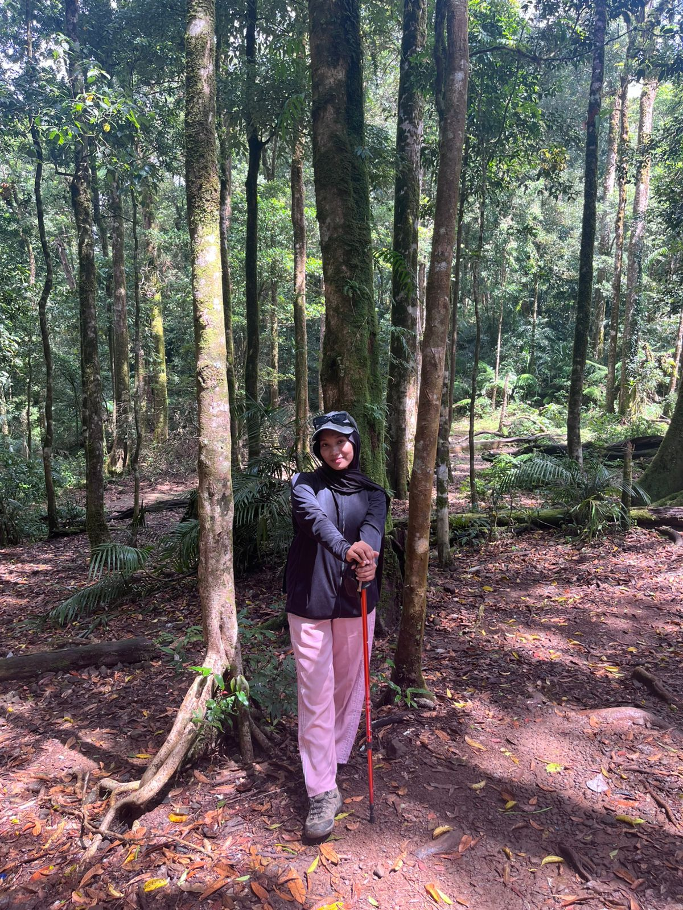

# Analisis Biografi
1. HTML
```html
    <!DOCTYPE html>
    <html lang="id">
    <head>
    <div class="section">
        <h3>🎓 Riwayat Pendidikan</h3>
        <table>
          <tr><td>SD</td><td>: 2012-1017</td></tr>
          <tr><td>SMP</td><td>: 2018-2020</td></tr>
          <tr><td>SMA</td><td>: 2021-2024</td></tr>
          <tr><td>Kuliah</td><td>: Universitas Negeri Makassar</td></tr>
        </table>
      </div>
```

Pertama, bagian riwayat pendidikan dibuat dengan elemen <div> yang berisi judul kecil (`<h3>`) dan sebuah tabel (<table>). Tabel ini menampilkan data pendidikan mulai dari SD, SMP, SMA, hingga kuliah, masing-masing ditulis dalam baris (<tr>) dengan dua kolom (<td>), yaitu nama jenjang dan tahun atau universitasnya.


2. HTML
```html
    <div class="section">
        <h3>📩 Kontak</h3>
        <div class="contact-links">
          <a href="https://wa.me/6281349455410" target="_blank" class="wa-btn">💬 Chat via WhatsApp</a>
          <a href="https://instagram.com/ikaakaaaa" target="_blank" class="ig-btn">📷 Kunjungi Instagram</a>
          <a href="https://tiktok.com/wehh06_" target="_blank" class="ig-btn">📷 Kunjungi TikTok</a>
        </div>
        <textarea rows="3" placeholder="Tulis pesanmu di sini..."></textarea>
        <button type="submit">Kirim Yuk 🚀</button>
      </div>
    </div>
```

Kedua, bagian kontak menampilkan link menuju WhatsApp, Instagram, dan TikTok. Masing-masing link menggunakan elemen <a> dengan target="_blank", sehingga ketika diklik akan membuka di tab baru. Selain itu, ada juga sebuah kotak teks (<textarea>) tempat pengunjung bisa menuliskan pesan, dan sebuah tombol (<button>) bertuliskan "Kirim Yuk 🚀" sebagai simulasi pengiriman pesan.

3. HTML
```html
    <div class="slide">
      <h2>🖼️ Galeri Foto</h2>
      <div class="gallery-container">
        
        
        
        
        
      </div>
    </div>
```

Ketiga, bagian galeri foto disusun dalam sebuah container (<div class="gallery-container">) yang berisi beberapa gambar (). Gambar-gambar ini akan ditampilkan sebagai slideshow. Untuk memindahkan gambar, disediakan tombol navigasi berupa panah kiri dan kanan (prev dan next) yang menggunakan event onclick untuk memanggil fungsi JavaScript bernama plusSlides(). Selain itu, ada juga titik-titik kecil (dots) di bawah galeri yang berfungsi sebagai indikator slide. Ketika titik tersebut diklik, fungsi currentSlide() dipanggil agar langsung menampilkan foto tertentu.

4. HTML
```html
    <a class="prev" onclick="plusSlides(-1)">&#10094;</a>
    <a class="next" onclick="plusSlides(1)">&#10095;</a>
  </div>

  <div class="dots">
    <span onclick="currentSlide(1)" class="active"></span>
    <span onclick="currentSlide(2)"></span>
    <span onclick="currentSlide(3)"></span>
  </div>

  <script>
    let slideIndex = 1;

    function showSlides(n) {
      const slides = document.querySelectorAll(".slide");
      const dots = document.querySelectorAll(".dots span");

      if (n > slides.length) slideIndex = 1;
      if (n < 1) slideIndex = slides.length;

      slides.forEach(slide => slide.classList.remove("active"));
      dots.forEach(dot => dot.classList.remove("active"));

      slides[slideIndex-1].classList.add("active");
      dots[slideIndex-1].classList.add("active");
    }

    function plusSlides(n) {
      showSlides(slideIndex += n);
    }

    function currentSlide(n) {
      showSlides(slideIndex = n);
    }
  </script>

</body>
</html>
```

Keempat, bagian JavaScript mengatur logika perpindahan slide. Variabel slideIndex dipakai untuk menyimpan slide mana yang sedang aktif. Fungsi showSlides(n) digunakan untuk menampilkan slide sesuai index yang dipilih. Jika index melebihi jumlah slide, maka otomatis kembali ke slide pertama, sedangkan jika index kurang dari satu, maka kembali ke slide terakhir. Setiap kali fungsi ini dijalankan, semua slide dan titik indikator direset dulu (class "active" dihapus), lalu hanya slide dan titik yang sesuai dengan slideIndex yang ditandai aktif.