# Analisis Biografi
1. HTML
```html
    <HTML>
    <HEAD><TITLE> contoh sederhana JavaScript</TITLE></HEAD>
    <BODY>
    <script languange="JavaScript">
        document.write("Selamat Belajar Angkatan 2024","<br>");
        document.write("JavaScript Pemrograman WEB Teknik Komputer");
    </script>
    </BODY>
    </HTML>
```

Kode dimulai dengan deklarasi <HTML> yang menandakan awal dokumen HTML, lalu di bagian <HEAD> terdapat elemen <TITLE> contoh sederhana JavaScript</TITLE> yang berfungsi memberikan judul pada halaman web, yaitu “contoh sederhana JavaScript”. Judul ini akan tampil di tab browser.

Pada bagian <BODY> terdapat sebuah blok <script languange="JavaScript"> ... </script> yang digunakan untuk menuliskan kode program JavaScript. Meskipun terdapat atribut languange, seharusnya penulisannya adalah language, namun browser modern tetap bisa mengenali bahwa script ini adalah JavaScript.

Di dalam script, terdapat dua perintah document.write(). Perintah pertama menuliskan teks “Selamat Belajar Angkatan 2024” di halaman web dan menambahkan tag <br> untuk membuat baris baru. Perintah kedua menuliskan teks “JavaScript Pemrograman WEB Teknik Komputer” tepat di bawah teks pertama.

Dengan demikian, saat halaman ini dijalankan, di layar browser akan tampil dua baris tulisan:

Selamat Belajar Angkatan 2024

JavaScript Pemrograman WEB Teknik Komputer

Jadi, kode ini merupakan contoh paling sederhana bagaimana JavaScript digunakan untuk menampilkan teks ke halaman web.

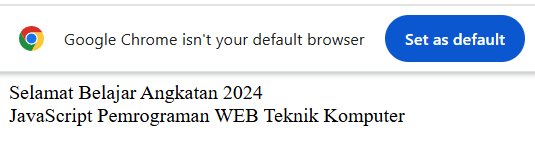


2. HTML
```html
    <!DOCTYPE html> 
<html> 
    <head> 
        <title>Belajar Javascript : Mengenal Event Pada Javascript</title> 
    </head> 
<body> 
 <h1>Mengenal Event Pada Javascript</h1> 
 <h2> Perograman WEB Event one click</h2> 
 <button onclick="tampilkan_nama()">klik disini </button> 
  
 <div id="hasil"></div> 
  
 <script>   
  function tampilkan_nama(){ 
   document.getElementById("hasil").innerHTML = 
"<h3>Hai, Nama Saya Ika Maryana Mudrikah</h3>"; 
  } 
</script> 
</body> 
</html>
```

Kode dimulai dengan <!DOCTYPE html> yang menyatakan bahwa dokumen menggunakan standar HTML5. Lalu, pada tag <head> terdapat <title>Belajar Javascript : Mengenal Event Pada Javascript</title> yang memberikan judul pada halaman, yaitu “Belajar Javascript : Mengenal Event Pada Javascript”.

Di dalam <body>, terdapat heading `<h1>` dengan tulisan “Mengenal Event Pada Javascript” sebagai judul utama halaman, dan dengan tulisan “Perograman WEB Event one click” sebagai subjudul.

Selanjutnya, terdapat sebuah tombol <button onclick="tampilkan_nama()">klik disini </button>. Tombol ini memiliki event onclick, artinya ketika tombol diklik, maka fungsi JavaScript bernama tampilkan_nama() akan dijalankan.

Di bawah tombol terdapat <div id="hasil"></div>, yaitu sebuah wadah kosong dengan id="hasil" yang akan digunakan untuk menampilkan hasil keluaran dari fungsi JavaScript.

Bagian <script> berisi definisi fungsi tampilkan_nama(). Di dalam fungsi ini, terdapat perintah:

document.getElementById("hasil").innerHTML = " `<h3>` Hai, Nama Saya Ika Maryana Mudrikah `</h3>` ";


Perintah tersebut akan mencari elemen dengan id="hasil" lalu mengisinya dengan teks berupa heading `<h3>` yang bertuliskan “Hai, Nama Saya Ika Maryana Mudrikah”.

Dengan demikian, ketika halaman dijalankan, pengguna akan melihat judul, subjudul, sebuah tombol, dan area kosong di bawah tombol. Jika pengguna menekan tombol “klik disini”, maka tulisan “Hai, Nama Saya Ika Maryana Mudrikah” akan muncul pada area kosong tersebut.

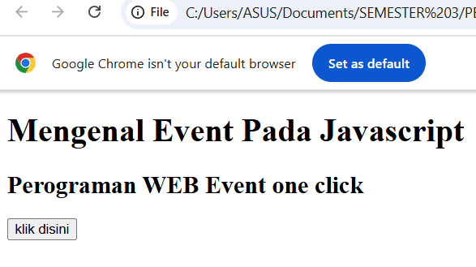
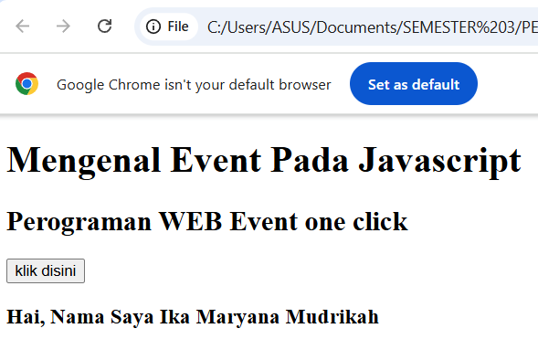

3. HTML 
```html
    <HTML>
    <HEAD>
     </HEAD>
    <BODY>
        <script language="Javascript">

        <!--
            var a = 12;  
            var b = 4;  
            function Perkalian_Dengan2(b) {  
                a = b * 2;  
                return a;  
            }  
            document.write("Dua kali dari",b,"adalah",Perkalian_Dengan2(b));  
            document.write("Nilai dari a adalah",a);  
        // -->
        </script>
    </BODY>
    </HTML>
```

Kode dimulai dengan tag <HTML>, lalu <HEAD> yang kosong, dan bagian utama ada di dalam <BODY>. Pada <BODY> terdapat sebuah blok <script language="Javascript"> yang berisi program JavaScript sederhana.

Di dalam script, mula-mula dideklarasikan dua variabel: var a = 12; dan var b = 4;. Jadi nilai awal variabel a adalah 12 dan variabel b adalah 4.

Setelah itu didefinisikan sebuah fungsi bernama Perkalian_Dengan2(b). Fungsi ini menerima parameter b, lalu menghitung hasil perkalian b * 2 dan menyimpannya kembali ke variabel a. Fungsi ini kemudian mengembalikan nilai a sebagai hasil.
Selanjutnya, perintah:
document.write("Dua kali dari", b, "adalah", Perkalian_Dengan2(b));

akan menuliskan ke halaman web kalimat “Dua kali dari 4 adalah 8”, karena fungsi Perkalian_Dengan2(4) menghasilkan nilai 8.
Kemudian, perintah:
document.write("Nilai dari a adalah", a);

akan menampilkan nilai dari variabel a. Karena sebelumnya a sudah diubah oleh fungsi menjadi 8, maka yang ditampilkan adalah “Nilai dari a adalah 8”.
Dengan demikian, saat kode dijalankan, halaman web akan menampilkan dua baris:
Dua kali dari 4 adalah 8
Nilai dari a adalah 8

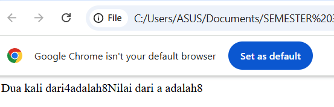


4. HTML
```html
    <HTML>
<HEAD><TITLE> contoh Javascript</TITLE>
  <script languange="JavaScript">
    document.write("Program JavaScript Aku di kepala");
  </script>
</HEAD>
<BODY>
  <script languange="JavaScript">
    document.write("Program JavaScript Aku di body");
  </script>
</BODY>
</HTML>
```

Kode dimulai dengan tag <HTML> lalu di dalam <HEAD> terdapat <TITLE> contoh Javascript</TITLE> yang memberi judul pada halaman, yaitu “contoh Javascript”. Judul ini akan tampil di tab browser.

Masih di dalam bagian <HEAD>, terdapat sebuah blok <script languange="JavaScript"> (seharusnya ditulis language, tapi tetap terbaca oleh browser). Script ini berisi perintah:
document.write("Program JavaScript Aku di kepala");

Perintah ini akan menampilkan tulisan “Program JavaScript Aku di kepala” pada halaman web.
Kemudian di dalam <BODY> terdapat script lain yang mirip, dengan isi:
document.write("Program JavaScript Aku di body");

Perintah ini akan menampilkan tulisan “Program JavaScript Aku di body” di halaman web juga.
Dengan demikian, saat halaman dijalankan, browser akan menampilkan dua teks hasil document.write(). Yang pertama ditulis saat halaman masih di bagian head, dan yang kedua ditulis saat halaman di bagian body.
Hasil akhirnya di browser akan terlihat tulisan:
Program JavaScript Aku di kepalaProgram JavaScript Aku di body.
(keduanya menyatu dalam satu baris karena tidak ada <br> untuk pindah baris).

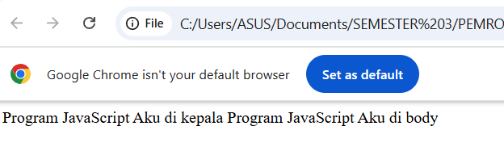


5. HTML
```html
    <HTML>
    <HEAD>
        <TITLE>Alert Box</TITLE>
    </HEAD>
    <BODY>
        <script languange="JavaScript">
            <!--
                window.alert("Apakah anda akan meninggalkan laman ini?");
            -->
        </script>
    <HEAD> 
        <TITLE>Konfirmasi</TITLE> 
    </HEAD> 
    <BODY> 
        <script languange = "JavaScript"> 
            <!-- 
                var jawaban = window.confirm( 
                 "Apakah anda sudah yakin ?"); 
                document.write("Jawaban Anda: " + jawaban); 
            --> 
        </script> 
    </BODY>
    </BODY>
    </HTML>
```

Kode dimulai dengan <HTML>, lalu di dalam <HEAD> ada judul halaman <TITLE>Alert Box</TITLE>. Pada bagian <BODY> pertama, terdapat sebuah script JavaScript sederhana:
window.alert("Apakah anda akan meninggalkan laman ini?");

Perintah ini akan menampilkan kotak pesan (alert box) di browser dengan teks “Apakah anda akan meninggalkan laman ini?”. Pengguna hanya bisa menekan tombol OK untuk menutupnya.

Setelah itu, kode kembali menuliskan <HEAD> dengan <TITLE>Konfirmasi</TITLE> (sebenarnya penulisan ini kurang tepat karena dalam HTML hanya boleh ada satu <head> dan satu <body>). Namun isi script kedua tetap bisa dijalankan.
Di dalam <BODY> kedua terdapat script:
var jawaban = window.confirm("Apakah anda sudah yakin ?");
document.write("Jawaban Anda: " + jawaban);

Perintah window.confirm() akan menampilkan kotak konfirmasi dengan pesan “Apakah anda sudah yakin ?” dan memberikan dua pilihan tombol, yaitu OK dan Cancel. Jika pengguna menekan OK, maka variabel jawaban bernilai true. Jika menekan Cancel, maka jawaban bernilai false.

Kemudian document.write() akan menampilkan teks “Jawaban Anda: true” jika pengguna menekan OK, atau “Jawaban Anda: false” jika pengguna menekan Cancel.

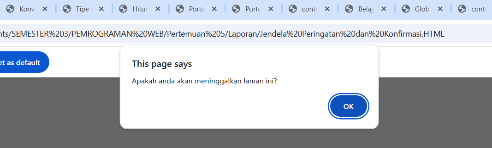
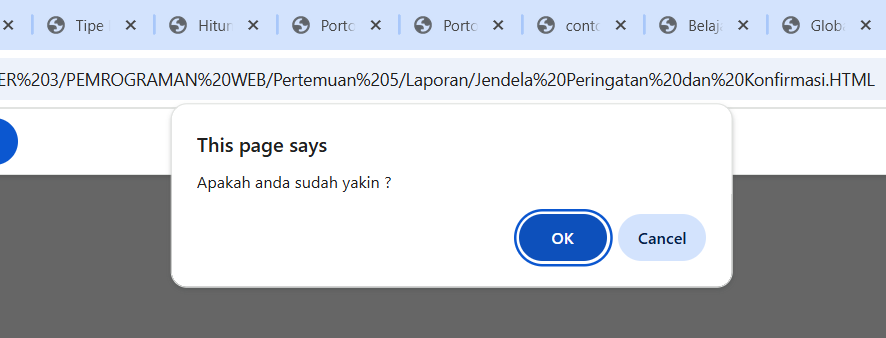
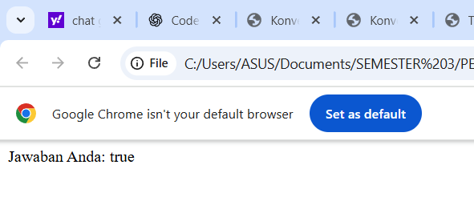


6. HTML
```html
    <HTML> 
    <HEAD> 
        <TITLE>Konversi Bilangan</TITLE> 
    </HEAD> 
    <BODY> 
        <SCRIPT LANGUAGE = JavaScript > 
    <!--
        var a = parseInt("27"); 
        document.write("1."+ a +"<BR>"); 
        a = parseInt("27.5"); 
        document.write("2."+ a +"<BR>"); 
        var a = parseInt("27A"); 
        document.write( "3."+ a +"<BR>"); 
        a = parseInt("A27.5"); 
        document.write( "4."+ a +"<BR>"); 
        var b = parseFloat("27"); 
        document.write("5."+ b +"<BR>"); 
        b = parseFloat("27.5"); 
        document.write("6."+ b +"<BR"); 
        var b = parseFloat("27A"); 
        document.write("7."+ b +"<BR>"); 
        b = parseFloat("A27.5"); 
        document.write("8"+ b + "<BR>"); 
    // -->
        </SCRIPT> 
    </BODY> 
    </HTML> 
```

Kode HTML ini membuat halaman dengan judul “Konversi Bilangan”. Di dalam <BODY> terdapat sebuah script JavaScript yang digunakan untuk mencoba fungsi parseInt() dan parseFloat().

Pertama, var a = parseInt("27"); akan mengubah string "27" menjadi bilangan bulat 27, kemudian ditampilkan dengan document.write("1."+ a +"<BR>"); sehingga hasilnya adalah 1.27.

Kedua, a = parseInt("27.5"); akan membaca hanya bagian bulat dari "27.5", sehingga hasilnya 27, lalu ditampilkan sebagai 2.27.

Ketiga, a = parseInt("27A"); akan membaca angka di depan string "27A", sehingga hasilnya 27, lalu ditampilkan sebagai 3.27.

Keempat, a = parseInt("A27.5"); mencoba membaca angka dari string "A27.5". Karena string diawali huruf, maka hasilnya NaN (Not a Number), lalu ditampilkan sebagai 4.NaN.

Selanjutnya, var b = parseFloat("27"); akan mengubah string "27" menjadi bilangan desimal 27, ditampilkan sebagai 5.27.

Lalu, b = parseFloat("27.5"); akan menghasilkan bilangan desimal 27.5, ditampilkan sebagai 6.27.5.

Berikutnya, b = parseFloat("27A"); akan membaca hanya angka di depan string "27A", sehingga hasilnya 27, ditampilkan sebagai 7.27.

Terakhir, b = parseFloat("A27.5"); mencoba membaca angka dari string "A27.5". Karena string diawali huruf, hasilnya NaN, lalu ditampilkan sebagai 8.NaN.

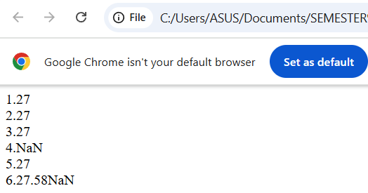


7. HTML
```html
    <HTML>
    <HEAD>
        <TITILE>Masukkan Data</TITILE>
    </HEAD>
    <BODY>
        <script language="JavaScript">
            <!--
                var nama = prompt("Siapa nama Anda?");
                document.write("Hai," + nama);
                -->
        </script>
    </BODY>
    </HTML>
```

Kode dimulai dengan tag <HTML> lalu bagian <HEAD> berisi <TITILE>Masukkan Data</TITILE> (sebenarnya ada salah ketik, seharusnya TITLE, bukan TITILE). Judul halaman ini adalah “Masukkan Data”.

Di bagian <BODY> terdapat sebuah blok <script language="JavaScript"> yang berisi program sederhana.
Pertama, ada perintah:
var nama = prompt("Siapa nama Anda?");

Perintah ini akan memunculkan kotak dialog prompt di browser dengan pertanyaan “Siapa nama Anda?”. Pengguna dapat mengetikkan jawaban berupa teks di kotak tersebut. Nilai yang dimasukkan akan disimpan ke dalam variabel nama.
Kemudian ada perintah:
document.write("Hai," + nama);

Perintah ini akan menuliskan teks ke halaman web. Hasilnya adalah kata “Hai,” diikuti dengan nama yang tadi dimasukkan pengguna.
Contoh: jika pengguna mengetik Ika, maka di layar akan tampil:
Hai,Ika

Jadi, kode ini adalah contoh penggunaan prompt di JavaScript untuk meminta input dari pengguna, lalu menampilkannya kembali di halaman web.

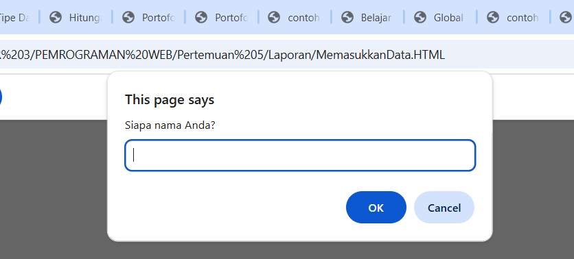


8. HTML
```html
    <HTML> 
    <HEAD> 
        <TITLE>Operasi Matematika</TITLE> 
    </HEAD> 
    <BODY>
        <SCRIPT LANGUAGE = "JavaScript"> 
        <!-- 
            document.write("2 + 3 = " + (2 + 3) ); 
            document.write("<BR>"); 
            document.write("20 + 3 = " + (20 - 3) ); 
            document.write("<BR>"); 
            document.write("20* 3 = " + (2 * 3) ); 
            document.write("<BR>"); 
            document.write("40 / 3 = " + (40 / 3) ); 
            document.write("<BR>"); 
        //--> 
        </SCRIPT> 
    </BODY> 
    </HTML>
```

Kode HTML ini membuat halaman dengan judul “Operasi Matematika”. Di dalam <BODY> terdapat sebuah script JavaScript yang digunakan untuk menampilkan hasil operasi hitung langsung di halaman web.
Isi programnya adalah:
document.write("2 + 3 = " + (2 + 3) );
→ Menuliskan teks “2 + 3 = 5” ke halaman, karena hasil penjumlahan 2 + 3 adalah 5.

document.write("<BR>");
→ Menambahkan baris baru (line break), supaya hasil berikutnya tampil di bawahnya.

document.write("20 + 3 = " + (20 - 3) );
→ Meskipun teks menulis “20 + 3”, sebenarnya operasi yang dilakukan adalah pengurangan (20 - 3). Hasilnya 17, sehingga ditampilkan “20 + 3 = 17”. (Ada sedikit salah tulis di kodenya).

document.write("<BR>");
→ Menambahkan baris baru.

document.write("20* 3 = " + (2 * 3) );
→ Teks menulis “20* 3”, tetapi operasi sebenarnya adalah perkalian 2 * 3. Hasilnya 6, sehingga ditampilkan “20 3 = 6”*. (Ini juga ada salah penulisan angka).

document.write("<BR>");
→ Menambahkan baris baru lagi.

document.write("40 / 3 = " + (40 / 3) );
→ Menampilkan hasil pembagian 40 dibagi 3, yaitu 13.3333…, sehingga ditampilkan “40 / 3 = 13.3333…”.

document.write("<BR>");
→ Membuat baris baru.


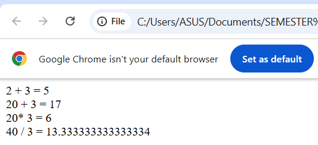


9. HTML
```html
    <HTML> 
    <HEAD> 
        <TITLE>Operator ?</TITLE> 
    </HEAD> 
    <BODY> 
        <SCRIPT LANGUAGE = "JavaScript"> 
        <!-- 
            var nilai = prompt("Nilai (0-100): ", 0); 
            var hasil = (nilai >= 60) ? "Lulus" : "Tidak Lulus"; 
            document.write("Hasil: " + hasil); 
            //--> 
        </SCRIPT> 
        </BODY> 
    </HTML>
```

Kode HTML ini membuat sebuah halaman dengan judul “Operator ?”. Di dalam bagian <BODY> terdapat sebuah script JavaScript yang memperlihatkan penggunaan operator ternary (? :) untuk menentukan hasil kelulusan berdasarkan nilai.
Pertama, baris:
var nilai = prompt("Nilai (0-100): ", 0);

akan memunculkan kotak dialog prompt yang meminta pengguna memasukkan nilai antara 0 sampai 100. Jika pengguna tidak mengetikkan apa-apa, nilai awal yang ditampilkan adalah 0. Nilai yang dimasukkan kemudian disimpan dalam variabel nilai.
Berikutnya, baris:
var hasil = (nilai >= 60) ? "Lulus" : "Tidak Lulus";

adalah penggunaan operator ternary. Logikanya adalah:
Jika nilai >= 60, maka variabel hasil akan berisi teks "Lulus".
Jika nilai < 60, maka variabel hasil akan berisi teks "Tidak Lulus".

Kemudian baris terakhir:
document.write("Hasil: " + hasil);
akan menuliskan hasil evaluasi tersebut ke halaman web.
Contoh:
Jika pengguna memasukkan 80, maka output di browser adalah “Hasil: Lulus”.
Jika pengguna memasukkan 45, maka output di browser adalah “Hasil: Tidak Lulus”.
Dengan demikian, program ini adalah contoh sederhana penggunaan operator ? : (ternary) dalam JavaScript untuk membuat keputusan cepat berdasarkan kondisi

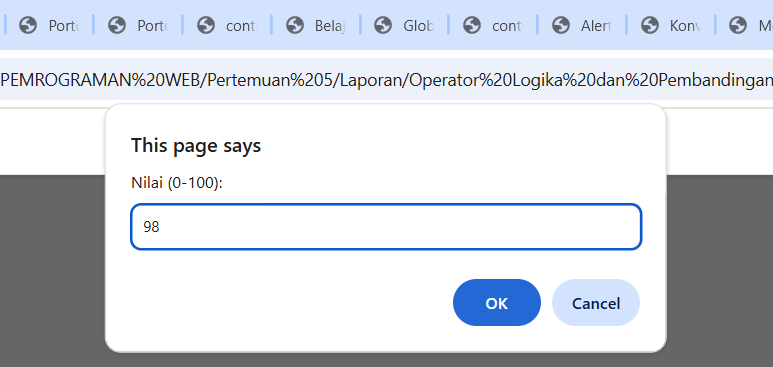
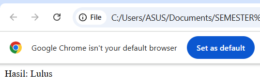
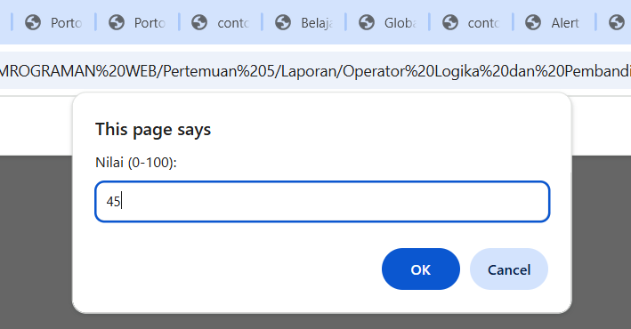
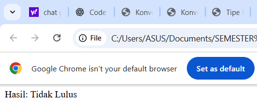